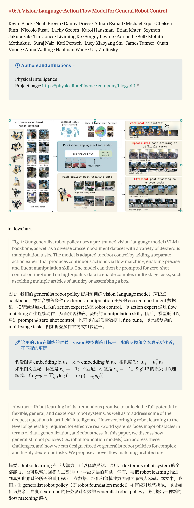

# Markdown to Obsidian Paper Card

以**论文排版与阅读体验**为核心的 Codex skill：将论文 Markdown 整理为适合 Obsidian 阅读的笔记，补齐图片超链接、文献上角标超链接引用与公式检查，并通过 subagent 生成完整中英对照。

本仓库发布 skill 和本地 Python 工具，不包含私人 vault、Zotero 数据库、论文包、模型凭据或历史会话。代码采用 [MIT](LICENSE)；外部依赖和互操作来源见 [THIRD_PARTY_NOTICES.md](THIRD_PARTY_NOTICES.md)。

## 效果展示

<a href="docs/images/paper-card-preview.png">
  
</a>

以 π0 论文为例，展示 Obsidian 中的插图、英文原文、中文对照和公式呈现。截图包含使用者补充的学习批注；实际外观取决于主题及插件，并非所有批注都由 skill 自动生成。点击图片可查看原图。

论文内容与插图来自 [π0 项目](https://www.physicalintelligence.company/blog/pi0)，相关权利属于原作者；展示截图不适用本仓库代码的 MIT 许可。

## 能做什么

### 1. 核心：让论文在 Obsidian 中更好读

- **图片超链接**：将正文中的 `Figure 1`、`Fig. 1` 等图号关联到对应图片，方便点击查看；配合 Obsidian 的悬停预览功能，可以直接预览图像。图片归档为 vault 内稳定的相对路径，避免临时路径失效。
- **文献上角标超链接引用**：把正文中的数字文献引用整理为可点击的上角标，跳转到文末对应参考文献，减少阅读时反复查找编号的操作。
- **公式排版**：检查 Obsidian/MathJax 所需的公式定界符，处理可确定识别的图注重复 TeX 显示内容，并在排版与翻译过程中保护公式。
- **整体版式整理**：规范标题、摘要、图注、表格与参考文献，让网页剪藏或 OCR 得到的 Markdown 更适合连续阅读。

图片目标或参考文献对应关系存在歧义时保留原文并报告，不猜测跳转目标。只需要排版时可选择 `translation-mode=none`。

### 2. 使用 subagent 翻译，生成中英对照

由专用 `paper-translation-worker` 原生子代理完成论文翻译，生成逐段对应的英文原文与中文译文，方便对照阅读和核查术语。正文、标题、图表说明等语义内容进入翻译流程；公式、引用和受保护标记在翻译前冻结、返回后校验。

参考文献保留英文书目信息，只附加作品题名的中文翻译。已通过验证的译文可以缓存复用，减少中断恢复时重复翻译。完整双语流程使用 `translation-mode=bilingual`，需要先配置对应的 Codex 子代理运行环境。

### 3. 公式校对与完整性检查

检查行内 `$...$`、独立公式 `$$...$$` 的定界符配对，以及公式在翻译前后的保护标记与内容完整性；对可确定的重复显示问题进行修复。

OCR 中的符号误识别、上下标含义和数学推导是否正确，需要结合原始 PDF 或 HTML 逐式复核。当前自动检查主要覆盖格式、渲染结构和传输完整性，不能把校验通过等同于数学语义已经正确。

## 论文文件从哪里来

本 skill 的处理入口是 **Markdown**。先把论文内容及图片准备好，再进行排版、公式检查和中英对照翻译。

| 论文来源 | 推荐准备方式 | 交给本 skill 的内容 |
| --- | --- | --- |
| **PDF 论文** | 先通过 OCR/文档解析转换为 Markdown，推荐使用 [MinerU 线上转换](https://mineru.net/) | 导出的 `.md` 与配套图片；保持附件路径可解析 |
| **HTML 论文**，例如 arXiv 提供的 HTML 全文 | 使用 [Obsidian Web Clipper](https://help.obsidian.md/web-clipper) 浏览器扩展直接剪藏到 vault，建议保存到 `Clippings/` | 剪藏得到的 Markdown；检查是否保留了全文、公式和图片 |
| **已有 Markdown** | 直接提供文件，无需重新 OCR | `.md` 与可访问的图片资源，或带附件映射的 source package |
| **Zotero 中的 PDF** | 可按题名定位本地附件，再走 PDF → Markdown 的解析步骤 | 已解析的 Markdown 或 source package；定位到 PDF 不代表已完成识别 |

对于有 HTML 全文的论文，可以直接剪藏 HTML，不必先下载 PDF 再 OCR。剪藏完成后由本 skill 继续清理网页噪声、整理图文与引用，并按需翻译；只有摘要页时，不能将摘要剪藏当作论文全文。

按题名启动时，先查找 `Clippings/`，再查找 `论文/`，最后才定位 Zotero 来源，优先复用已有 Markdown。MinerU 负责前置解析，本 skill 负责后续论文卡处理：可手动使用 MinerU 网站，也可另行安装 `mineru-api-markdown` skill。本仓库不附带该解析 skill，不调用 MinerU API，也不默认授予 PDF 上传许可。

## 环境与安装

需要 Python **3.11 或以上**。首版以 Windows 11 / PowerShell 为验证平台，不宣称 Linux、macOS 或其他 agent 宿主已经通过端到端验证。

| 用途 | 依赖 |
| --- | --- |
| 核心脚本、图片检查与测试 | `requirements.txt`：Pillow、PyYAML |
| PDF figure 裁剪 | `requirements-pdf.txt`：另加 PyMuPDF；同时需要来源 PDF 和布局 JSON |
| 命名 BibTeX 引文 | 单独安装 [Pandoc](https://pandoc.org/installing.html)，加入 PATH |
| 原生双语翻译 | 已登录且支持自定义子代理的本地 Codex，可访问所选模型及本地 rollout |
| Zotero 来源 | 用户自己的 Zotero 数据目录；只读解析，不修改原数据库 |
| Spark 审查 | 可用的 `codex` CLI、相应模型权限和单独的数据发送授权 |

以下命令用于**首次安装到不存在的目标目录**，不要覆盖已有同名 skill。也可以将维护仓库放在代码目录，再仅将发布文件复制到自己的 skill 目录。

```powershell
$skillRoot = Join-Path $env:USERPROFILE '.agents/skills/markdown-to-obsidian-paper-card'
git clone https://github.com/le876/markdown-to-obsidian-paper-card.git $skillRoot
Set-Location -LiteralPath $skillRoot
py -3 -m venv .venv
& ./.venv/Scripts/python.exe -I -X utf8 -m pip install -r requirements.txt
```

需要 PDF 裁剪时再安装 `requirements-pdf.txt`。这不是必需组件，PyMuPDF 使用其自身的 AGPL/商业许可，而不是本仓库的 MIT 许可。

当前 Codex 文档支持用户级 `~/.agents/skills` 发现；若已在其他目录安装同名 skill，应只保留一个启用入口，避免重复选择。参见 [Codex skill 文档](https://developers.openai.com/codex/skills)。

## 先运行离线格式整理

下面只使用仓库内合成测试文本，不调用翻译模型。将 `D:/Notes/DemoVault` 换为你自己的测试 vault，命令从 skill 根目录执行。

```powershell
$vaultRoot = 'D:/Notes/DemoVault'
$paperPython = Join-Path $skillRoot '.venv/Scripts/python.exe'
New-Item -ItemType Directory -Path $vaultRoot -Force | Out-Null
& $paperPython -X utf8 scripts/build_obsidian_paper_card.py --input-markdown tests/fixtures/forward_runtime/source.md --vault-root $vaultRoot --output-note "$vaultRoot/论文/Demo.md" --translation-mode none
```

上面没有 `--write`，只返回 dry-run JSON；确认目标后加 `--write` 完成写入。输出会生成 Markdown 和 `.card-report.json`。输入输出相同时必须显式指定 `--in-place`，覆盖前会创建备份。示例没有远程资源，所以无需网络；实际输入含远程图片时请阅读下方数据边界。

## 配置并运行双语流程

双语标准路径由 **Codex 父任务 + 一个原生翻译子代理** 协作完成。直接运行 Python 不会自己启动原生子代理；`awaiting_native_subagent` 是正常交接状态，不是翻译完成。

用仓库规范生成目标 vault 的角色配置。下面的 `--write` 会创建或更新指定角色文件；已有自定义同名角色时先备份并审查差异。

```powershell
& $paperPython -X utf8 scripts/sync_paper_translation_agent_prompt.py --agent-path "$vaultRoot/.codex/agents/paper-translation-worker.toml" --write
& $paperPython -X utf8 scripts/sync_paper_translation_agent_prompt.py --agent-path "$vaultRoot/.codex/agents/paper-translation-worker.toml" --check
```

生成器包含 `name`、`description`、模型及权威翻译指令。按当前 [Codex 自定义子代理文档](https://developers.openai.com/codex/subagents)，项目角色放在 `.codex/agents/`；在该 vault 中重新打开任务，确认可选择 `paper-translation-worker`。项目配置应允许子代理；不要以整份他人的配置覆盖自己的配置。

默认翻译角色使用 `gpt-5.6-terra` / `high`，可选 Spark 使用 `gpt-5.3-codex-spark`。这些是本版本的运行配置，不保证每个账号或客户端都有权限。当前 builder 冻结该翻译模型与推理强度；仅改变角色生成器的 `--model` / `--reasoning-effort` 不能切换整条流水线，会触发一致性校验失败。模型不可用时可使用 `translation-mode=none`；双语模式需先满足该运行条件，或由维护者完成统一模型配置变更及回归验证。不要编辑运行证明或生成文件中的权威提示词来绕过错误。

在 Codex 中明确使用这个 skill，并提供源 Markdown 与目标 vault，例如：

> 使用 $markdown-to-obsidian-paper-card，把我指定的论文 Markdown 做成完整中英对照阅读卡，保存到当前 vault 的论文目录。允许为这篇论文使用配置的 paper-translation-worker 翻译子代理。

父任务执行的入口示例：

```powershell
& $paperPython -X utf8 scripts/build_obsidian_paper_card.py --input-markdown 'D:/Papers/source.md' --vault-root $vaultRoot --output-note "$vaultRoot/论文/Paper.md" --translation-mode bilingual --translation-stage run --workflow-dir "$vaultRoot/.tmp/paper-card-workflows/demo" --write
```

父任务按 [SKILL.md](SKILL.md) 处理返回的 `spawn_agent` 交接对象，执行 layout、等待子代理、导入运行证明，再 finalize。不要手工伪造缓存、attestation 或模型完成状态。CLI 的每阶段与排版参数详见 `--help`。

### 按题名使用 Zotero

```powershell
& $paperPython -X utf8 scripts/start_obsidian_paper_card.py --title 'Exact Paper Title' --zotero-data-dir 'D:/Zotero' --vault-root $vaultRoot --snapshot-directory "$vaultRoot/.tmp/zotero-snapshots" --workflow-dir "$vaultRoot/.tmp/paper-card-workflows/demo"
```

这个入口会写入工作流，不是 dry-run。先搜索 vault；仅在需要时读取 Zotero 并建立短期数据库快照。题名或 PDF 歧义会返回错误。返回 `requires_markdown_parse`（退出码 3）表示已经定位 PDF，但还需要独立解析阶段；它不代表上传已获授权或论文卡已完成。

## 数据与隐私边界

| 操作 | 数据流向 |
| --- | --- |
| 本地整理、引文、PDF 裁剪、Zotero 解析 | Python 在本地读取用户指定文件并写入指定 vault/工作流目录 |
| 原生翻译 | 父 Codex 任务读取源文件；冻结的正文、标题和必要书目单元经 Codex 发送给配置的模型服务 |
| 可选 Spark | 当前论文 Markdown 和排版规范经 Codex CLI 发送给所选模型；须有针对该文档的授权 |
| 远程图片 | 下载输入 Markdown 引用的图片；原站会收到 URL 请求及网络连接信息 |
| 可选 MinerU | 独立解析工具可能上传 PDF；必须由当前用户授权具体文件和目标服务 |

原生 bridge 的 `--discover-rollout` 会遍历本机 `~/.codex/sessions` 下的候选 rollout，以找到匹配的原生子代理记录；该目录可能包含其他私人会话。可用 `--sessions-root` 缩小范围，或用 `--rollout-path` 指向明确的当前子代理记录。这个读取用于本地验证，脚本没有将会话目录上传 GitHub 的功能。

工作流、report 和 attestation 可能包含论文内容、本地绝对路径、来源 URL、模型与会话标识，即使最终图片使用相对路径也不表示工作流已经匿名化。将运行目录放在发布仓库之外；不要把真实日志、数据库、论文、截图或会话直接附在公开 issue 中。使用合成输入复现问题，并在分享前自行审查。`.gitignore` 只降低误提交概率，不会清除已经提交的历史。

本项目不读取或附带个人 API key。Codex 的账号、服务、保留策略和宿主权限由用户自己的环境决定；本仓库不会替用户授予历史授权，也不通过修改账号、代理或关闭验证来绕过错误。

## 验证与维护

```powershell
& $paperPython -I -X utf8 -m unittest discover -s tests -v
& $paperPython -I -X utf8 -m compileall -q scripts tests
git diff --check
```

首版验证使用 Windows / Python 3.12、合成数据和本地测试环境。测试覆盖 Zotero 顺序与歧义、图片及引文、公式 token、角色冻结、原生证明验证、缓存、恢复和原子写入。测试里的模型结果/rollout 是合成记录；通过测试不等于完成真实模型翻译。首版发布检查未调用真实翻译模型、Spark 或 MinerU，未执行 Obsidian GUI 验收。

后续在维护仓库修改并测试，审查差异后再安装到运行目录。只推送源码及合成测试素材；每次发布检查暂存文件和提交身份。不要将当前运行目录反向整体覆盖到维护仓库。

### 区分维护仓库与安装副本

维护仓库目录建议命名为 `markdown-to-obsidian-paper-card-publish`，用于开发、测试、审查与推送；安装目录保持 `markdown-to-obsidian-paper-card`，用于实际转换论文。目录后缀不改变 GitHub 仓库名或 skill 的 `name`。

```powershell
git clone https://github.com/le876/markdown-to-obsidian-paper-card.git markdown-to-obsidian-paper-card-publish
```

已有独立维护仓库可以只重命名其目录；安装副本无需改名。更新仍从维护仓库经测试和审查后单向安装，不将运行数据同步到发布仓库。
